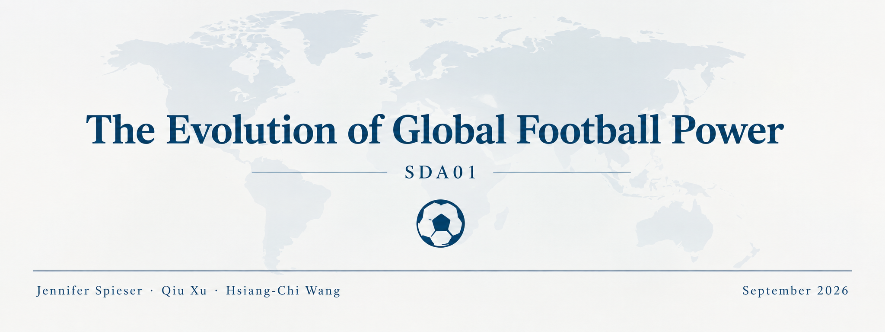

# Introduction

Football's global balance of power is constantly shifting: new generations emerge, football cultures develop, and confederations rise or fade in strength. Yet this evolution is easy to miss when teams are judged only by tournament results, which capture a single moment rather than a long run trend. Elo ratings offer a way to track that evolution directly. Unlike official rankings, they update continuously based on match outcomes, opponent quality, and game significance, giving a dynamic, historically comparable measure of team strength.

This project uses over a century of historical Elo ratings for national football teams to explore how global football power has shifted across countries, confederations, and time, using the 2026 FIFA World Cup as a focal point. Rather than treating the tournament as an isolated event, we situate it within each team's long run trajectory, asking whether traditional powers still dominate, whether confederation strength is converging, and how debutant or returning nations compare to established qualifiers.

# Data Source

The dataset used in this project, "2026 FIFA World Cup — Historical Elo Ratings," is publicly available on [Kaggle](https://www.kaggle.com/datasets/afonsofernandescruz/2026-fifa-world-cup-historical-elo-ratings).

The dataset compiles pre-tournament Elo ratings and complete historical career data for all **48 teams qualified for the 2026 FIFA World Cup**. Coverage spans 1901 to 2026, 125 years of international football history. Several of the 48 qualifiers exist today under a different name or political entity than they did historically. Where FIFA officially recognizes a successor relationship, the dataset folds the predecessor's rows into the modern team, so each of the 48 teams reflects one continuous time series spanning the longest history recognized by FIFA.

The data is structured as follows:

- One row per **team** & **year-end** snapshot
- Plus one live snapshot row per team at the file's creation date (snapshot date $\neq$ Dec 31), so there is always an as-of-today reading alongside by the year-end series

For this project, the raw file (`elo_ratings_wc2026.csv`) contains **4,635 rows and 24 variables**, covering:

- **Identification/time:** `year`, `snapshot_date`, `country`, `country_code`, `confederation`
- **Rating/ranking:** `rating`, `rank`, plus all-time max/min/avg for each country (`rating_max`, `rank_max`, `rating_min`, `rank_min`, `rating_avg`, `rank_avg`)
- **Match record:** cumulative counts of `matches_total/home/away/neutral`, `wins`, `losses`, `draws`, `goals_for`, `goals_against` as of the snapshot date
- **World Cup context:** `is_host`, `wc2026_exit_round`

# Data Preparation

Before starting the analysis, the data was assessed for consistency and integrity. It contains no missing or improbable values. The only NAs (in `wc2026_exit_round`) are expected, since not every country qualified for the tournament. The match counts add up correctly, and the dates fall within the expected range (1901–2026). Duplicate 2026 snapshots were split off into a separate World Cup dataset, leaving one snapshot per country per year.

```{r cleaning, eval=FALSE}
# Library
library(here)

# Load data
d.raw <- read.csv(here("data", "elo_ratings_wc2026.csv"))

# Check the dimensions
dim(d.raw)

# Convert snapshot_date to Date format
d.raw$snapshot_date <- as.Date(d.raw$snapshot_date)
class(d.raw$snapshot_date)

# Missing values 
colSums(is.na(d.raw))

# Duplicate values
sum(duplicated(d.raw))
sum(duplicated(d.raw[c("year", "country")]))

# Display duplicated country-year observations
d.raw[duplicated(d.raw[c("year", "country")]) | duplicated(d.raw[c("year", "country")], fromLast = TRUE),
  c("year", "country", "snapshot_date")]

# Date range
range(d.raw$year)                      
range(d.raw$snapshot_date) 

# Check number of matches and goals
all(d.raw$matches_total == d.raw$matches_home + d.raw$matches_away + d.raw$matches_neutral)
all(d.raw$matches_total == d.raw$wins + d.raw$losses + d.raw$draws)

# Extract midyear snapshot date
d.wc <- d.raw[d.raw$year == 2026 & d.raw$snapshot_date == as.Date("2026-07-07"),]

# Remove the July 2026 snapshot from the main dataset
d.full <- d.raw[!(d.raw$year == 2026 & d.raw$snapshot_date == as.Date("2026-07-07")),]

# Check the duplicate values again
sum(duplicated(d.full[c("year", "country")])) 

# Save into new datasets
write.csv(d.wc, "data/wc_elo_ratings.csv", row.names = FALSE)
write.csv(d.full, "data/elo_ratings.csv", row.names = FALSE)
```

# Global Overview of Elo Rating

```{r wc_overview, child="scripts/world_cup_descriptive.Rmd"}

```

# Qualifier Clustering by Elo Rating Trajectory

```{r wc_cluster, child="scripts/world_cup_clustering.Rmd"}

```

# World Cup Prediction

```{r wc_prediction, child="scripts/world_cup_prediction.Rmd"}

```

# World Cup Simulation

```{r wc_simulation, child="scripts/world_cup_simulation.Rmd"}

```

# Conclusion

# Sources

FootyStats. (n.d.). *2026 FIFA World Cup stats: xG, corners, and over 2.5 goals*. Retrieved September 20, 2026, from <https://footystats.org/world-cup>

Fédération Internationale de Football Association. (n.d.). *FIFA World Cup 2026 regulations*. <https://digitalhub.fifa.com/m/636f5c9c6f29771f/original/FWC2026_regulations_EN.pdf>

Fernandes Cruz, A. (n.d.). *2026 FIFA World Cup—Historical Elo ratings* [Data set]. Kaggle. <https://www.kaggle.com/datasets/afonsofernandescruz/2026-fifa-world-cup-historical-elo-ratings>

World Football Elo Ratings. (n.d.). *About the ratings*. <https://eloratings.net/about>

# Usage of Generative AI

We declare that generative AI tools were used as a supporting tool during this project to assist with troubleshooting and resolving coding issues, and correcting grammar and language. All analytical decisions, interpretation of results and conclusions were developed by the authors. No generative AI was used for the analysis or interpretation of the findings. fi
